# Linux Enterprise Gateway

Ubuntu-based network gateway and firewall for a multi-distro hybrid lab. Handles NAT, routing, and stateful packet inspection for Rocky Linux and Fedora clients using Netplan and iptables.

---

## Table of Contents

- [What I Built](#what-i-built)
- [Tech Stack and Environment](#tech-stack-and-environment)
- [Project Files](#project-files)
- [Network Topology](#network-topology)
- [The Build](#the-build)
  - [1. VirtualBox Network Adapters](#1-virtualbox-network-adapters)
  - [2. Netplan Dual Interface Configuration](#2-netplan-dual-interface-configuration)
  - [3. IP Forwarding](#3-ip-forwarding)
  - [4. iptables Firewall Rules](#4-iptables-firewall-rules)
  - [5. Firewall Persistence](#5-firewall-persistence)
  - [6. Client VM Configuration](#6-client-vm-configuration)
- [Troubleshooting and Real Issues](#troubleshooting-and-real-issues)
  - [Issue 1: VirtualBox vs KVM Conflict](#issue-1-virtualbox-vs-kvm-conflict)
  - [Issue 2: Static IP Blocking DHCP](#issue-2-static-ip-blocking-dhcp)
  - [Issue 3: Interface Vanished After Snapshot Restore](#issue-3-interface-vanished-after-snapshot-restore)
  - [Issue 4: apt Returning 404 on All Repos](#issue-4-apt-returning-404-on-all-repos)
  - [Issue 5: nmtui Authorization Error](#issue-5-nmtui-authorization-error)
  - [Issue 6: Rocky VM on the Wrong Network](#issue-6-rocky-vm-on-the-wrong-network)
- [Final Verification](#final-verification)
- [Key Skills Demonstrated](#key-skills-demonstrated)
- [What I Learned](#what-i-learned)

---

## What I Built

I turned a bare Ubuntu Server VM into a functioning router and firewall from scratch. It has two network interfaces: one facing the internet through VirtualBox NAT and one facing my internal lab network. Every other VM in my lab routes its traffic through it, the same way devices in your house go through your home router. The difference is I built the router myself, configuring two interfaces, NAT masquerading, IP forwarding in the kernel, stateful firewall rules, and persistence across reboots.

This isn't a tutorial follow-along. I hit real issues: an end-of-life Ubuntu with dead repos, a KVM conflict that stopped VMs from booting, a Netplan config blocking DHCP, and a Rocky VM on the wrong virtual network entirely. Each one is documented below with the cause and the fix.

---

## Tech Stack and Environment

| Component | Specification |
| :--- | :--- |
| Host OS | Rocky Linux 9.7 (Blue Onyx) |
| Hypervisor | Oracle VirtualBox |
| Gateway OS | Ubuntu Server 24.10 (Oracular - EOL) |
| Networking | Netplan |
| Firewall/NAT | iptables v1.8.10 (nf_tables) |
| Client 1 | Rocky Linux 9.5 |
| Client 2 | Fedora 35 (GUI) |

---

## Project Files

The `configs/` folder contains the actual configuration files I wrote during this project. The README explains the decisions, the configs folder shows the work.

| File | Source Path | What It Shows |
| :--- | :--- | :--- |
| [50-cloud-init.yaml](configs/50-cloud-init.yaml) | `/etc/netplan/50-cloud-init.yaml` | Dual interface config: DHCP on WAN, static IP on LAN |
| [rules.v4](configs/rules.v4) | `/etc/iptables/rules.v4` | NAT masquerade, outbound forwarding, stateful return rules |
| [sysctl.conf](configs/sysctl.conf) | `/etc/sysctl.conf` | Kernel IP forwarding enabled via net.ipv4.ip_forward=1 |
| [blacklist-kvm.conf](configs/blacklist-kvm.conf) | `/etc/modprobe.d/blacklist-kvm.conf` | KVM blacklist to prevent hypervisor conflict on boot |

---

## Network Topology

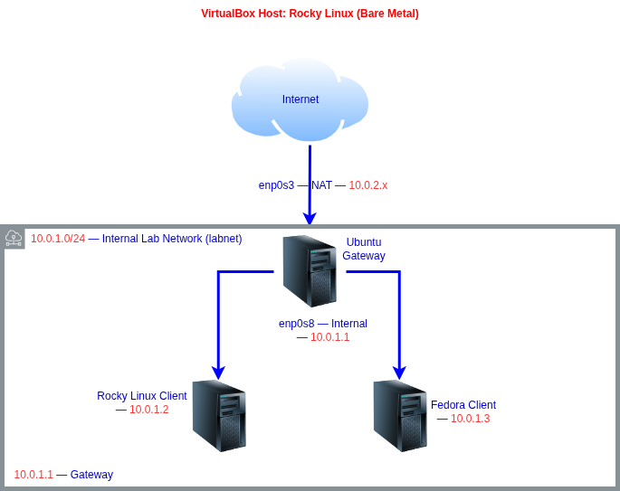

---

## The Build

### 1. VirtualBox Network Adapters

Before touching Ubuntu, I configured two adapters in VirtualBox. Adapter 1 is set to NAT, giving Ubuntu its WAN connection through the host machine. Adapter 2 is set to Internal Network named `labnet`, creating an isolated virtual switch that only lab VMs can see.

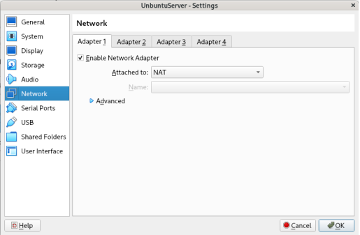
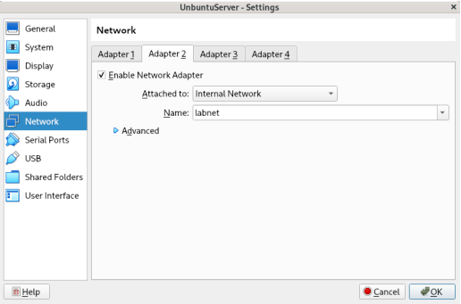

### 2. Netplan Dual Interface Configuration

I configured both interfaces in `/etc/netplan/50-cloud-init.yaml`:

```yaml
network:
  version: 2
  ethernets:
    enp0s3:
      dhcp4: true
    enp0s8:
      addresses:
        - 10.0.1.1/24
      nameservers:
        addresses:
          - 8.8.8.8
```

`enp0s3` gets its IP automatically from VirtualBox NAT via DHCP. `enp0s8` gets a static `10.0.1.1`, which becomes the gateway address every lab VM points to. Static is non-negotiable here: if the gateway address shifts, the whole lab breaks.

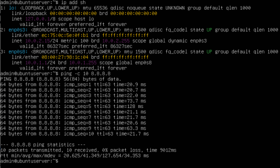

### 3. IP Forwarding

By default, Linux drops any packet not destined for itself. One line in `/etc/sysctl.conf` changes that behavior and tells the kernel to forward packets between interfaces instead:

```bash
net.ipv4.ip_forward=1
```

Applied immediately without rebooting:

```bash
sudo sysctl -p
```


### 4. iptables Firewall Rules

Three rules handle all the routing logic:

```bash
# NAT masquerade: stamps Ubuntu's IP on all outbound traffic
sudo iptables -t nat -A POSTROUTING -o enp0s3 -j MASQUERADE

# Forward outbound: allows LAN traffic to reach the WAN
sudo iptables -A FORWARD -i enp0s8 -o enp0s3 -j ACCEPT

# Stateful return: only allows replies to established connections back in
sudo iptables -A FORWARD -i enp0s3 -m state --state RELATED,ESTABLISHED -j ACCEPT
```

The third rule is what makes this a stateful firewall. Unsolicited inbound traffic gets dropped automatically, and only legitimate return traffic from connections that originated inside the lab is allowed back through.

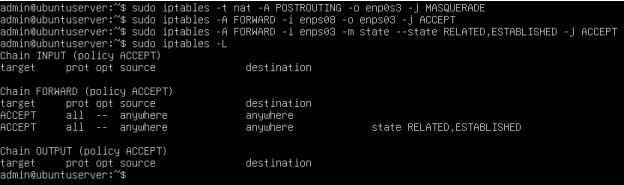

### 5. Firewall Persistence

iptables rules live in memory only, so a reboot wipes them completely. I installed `netfilter-persistent` to save the rules to disk and reload them automatically at boot:

```bash
sudo apt install netfilter-persistent iptables-persistent -y
```

Rules are saved to `/etc/iptables/rules.v4` and survive every reboot.

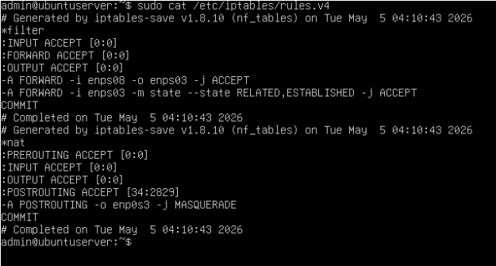

### 6. Client VM Configuration

I connected both Rocky Linux and Fedora to `labnet` in VirtualBox and assigned them static IPs pointing to Ubuntu as their gateway.

**Rocky Linux (configured via nmtui):**
```
IP: 10.0.1.2/24   Gateway: 10.0.1.1   DNS: 8.8.8.8
```

**Fedora (configured via GUI network settings):**
```
IP: 10.0.1.3/24   Gateway: 10.0.1.1   DNS: 8.8.8.8
```

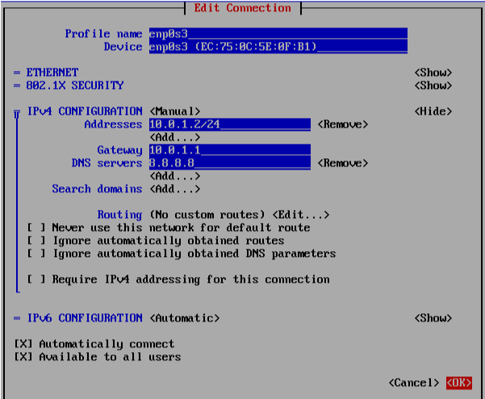
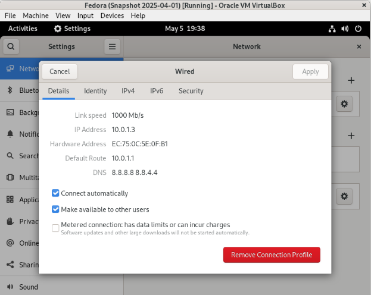

---

## Troubleshooting and Real Issues

### Issue 1: VirtualBox vs KVM Conflict

**Problem:** VirtualBox refused to start any VM, throwing `VERR_VMX_IN_VMX_ROOT_MODE`.

**Cause:** KVM kernel modules were auto-loading on the Rocky Linux host and locking CPU virtualization before VirtualBox could claim it. KVM is a Type 1 hypervisor built into the Linux kernel. VirtualBox is Type 2. They cannot share hardware virtualization at the same time.

**Fix:** I unloaded the KVM Intel modules and blacklisted them permanently so they never reload on reboot:

```bash
sudo modprobe -r kvm_intel
sudo modprobe -r kvm
echo "blacklist kvm_intel" | sudo tee /etc/modprobe.d/blacklist-kvm.conf
```

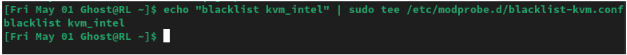

---

### Issue 2: Static IP Blocking DHCP

**Problem:** `enp0s3` had no internet connectivity and every ping returned "Destination Host Unreachable."

**Cause:** A leftover Netplan config had `enp0s3` hardcoded with `192.168.1.141` and a gateway of `192.168.1.254` from a previous setup. VirtualBox NAT hands out `10.0.2.x` addresses via DHCP, so the static config was fighting it and packets had nowhere to go.

**Fix:** I rewrote the Netplan config with `dhcp4: true` on `enp0s3` and applied it:

```bash
sudo netplan apply
```

Internet confirmed working immediately after.

---

### Issue 3: Interface Vanished After Snapshot Restore

**Problem:** After restoring an older snapshot, `enp0s8` disappeared from the VM entirely.

**Cause:** Restoring the snapshot reverted VirtualBox Adapter 2 settings along with the OS state, removing the `labnet` interface from the VM configuration.

**Fix:** I re-enabled Adapter 2 in VirtualBox settings as Internal Network named `labnet`, then re-applied Netplan. Both interfaces came back up correctly.

---

### Issue 4: apt Returning 404 on All Repos

**Problem:** `sudo apt update` returned 404 errors on every single repository.

**Cause:** Ubuntu 24.10 Oracular reached End of Life and the official mirrors were taken down. On top of that, Ubuntu 24.10 moved package sources from `/etc/apt/sources.list` to `/etc/apt/sources.list.d/ubuntu.sources`, so the fix had to target the new file location.

**Fix:**

```bash
sudo sed -i 's|ca.archive.ubuntu.com|old-releases.ubuntu.com|g' /etc/apt/sources.list.d/ubuntu.sources
sudo sed -i 's|security.ubuntu.com|old-releases.ubuntu.com|g' /etc/apt/sources.list.d/ubuntu.sources
sudo apt update
```

32.5MB fetched successfully after the redirect.

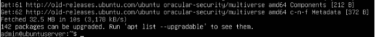

---

### Issue 5: nmtui Authorization Error

**Problem:** nmtui threw `GDBus.Error: The name is not activatable` when trying to save a network connection on Rocky Linux.

**Cause:** I launched nmtui without sudo. Without elevated privileges it cannot reach the DBus service that handles writing network configuration.

**Fix:**

```bash
sudo nmtui
```

---

### Issue 6: Rocky VM on the Wrong Network

**Problem:** Rocky could not ping Ubuntu at `10.0.1.1` even though its IP settings and routing table looked correct.

**Cause:** Rocky's VirtualBox adapter was set to Bridged Adapter instead of Internal Network. Rocky was sitting on my home network, not on `labnet`. The two VMs were on completely different virtual switches with no path to each other.

**Fix:** I changed the VirtualBox adapter from Bridged to Internal Network and set the name to `labnet`. After a reboot, all pings passed immediately.

This is a good example of a Layer 2 problem disguising itself as a Layer 3 problem. The IP config was never the issue.

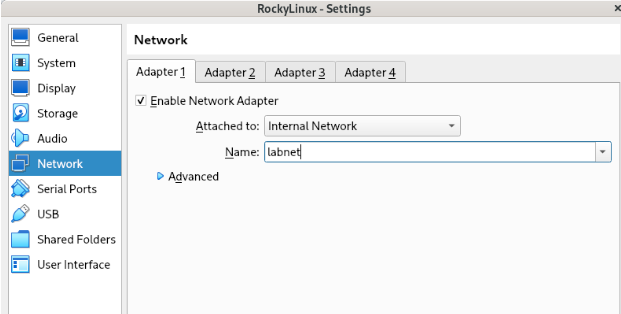

---

## Final Verification

| Test | From | To | Result |
| :--- | :--- | :--- | :--- |
| ping 10.0.1.1 | Rocky | Ubuntu LAN | PASS |
| ping 8.8.8.8 | Rocky | Internet | PASS |
| ping google.com | Rocky | DNS + Internet | PASS |
| ping 10.0.1.1 | Fedora | Ubuntu LAN | PASS |
| ping 8.8.8.8 | Fedora | Internet | PASS |
| ping google.com | Fedora | DNS + Internet | PASS |
| ping 10.0.1.2 | Fedora | Rocky VM | PASS |
| ping 10.0.1.3 | Rocky | Fedora VM | PASS |

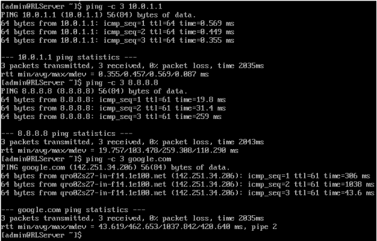
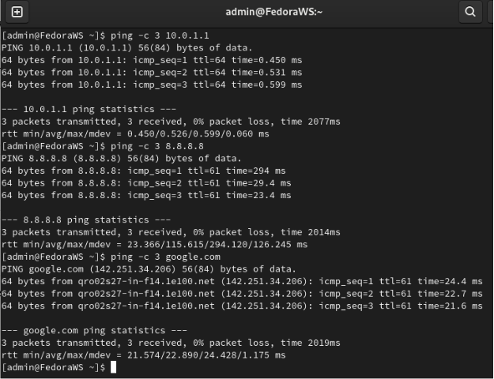
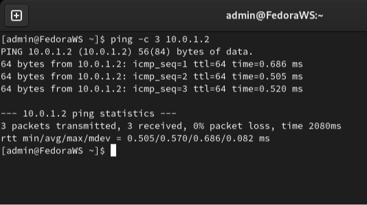
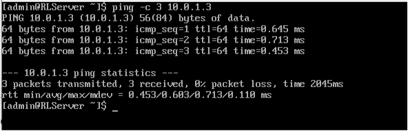

---

## Key Skills Demonstrated

- Dual-interface routing and NAT masquerading on Linux
- Netplan configuration for static and DHCP interfaces
- iptables stateful firewall rules with RELATED/ESTABLISHED inspection
- Linux kernel IP forwarding via sysctl
- Firewall rule persistence with netfilter-persistent
- VirtualBox internal network architecture and adapter management
- Real troubleshooting across hypervisor conflicts, EOL package management, and Layer 2 connectivity

---

## What I Learned

A working config means nothing if it doesn't survive a reboot. Persistence has to be part of the plan from day one, not an afterthought.

Layer 2 problems disguise themselves as Layer 3 problems. I spent time questioning IP settings before realizing Rocky was on the wrong virtual switch entirely. Always confirm the physical layer before touching addressing.

Ubuntu EOL is a real operational concern. Knowing where archived repos live and how to redirect sources without breaking the package manager is practical sysadmin knowledge that comes up in production environments.

Building the router myself made the theory click in a way that reading about it never does. I understand NAT masquerading and stateful inspection now because I debugged them when they didn't work.
